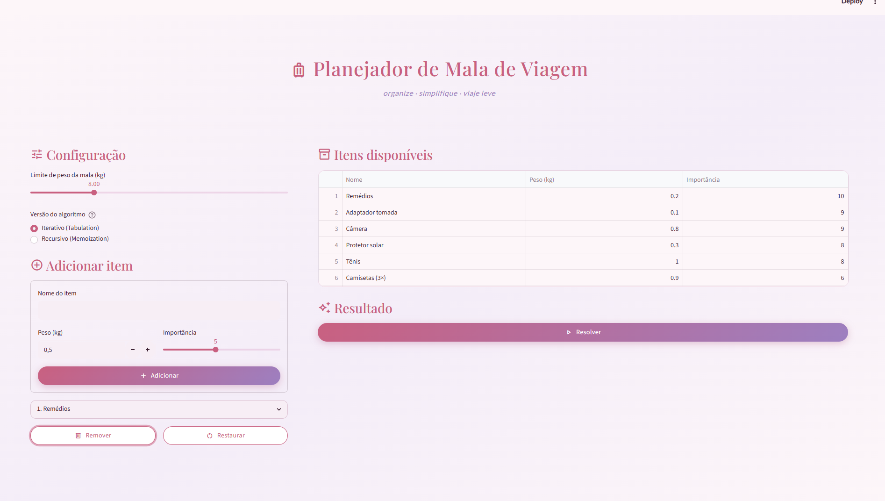
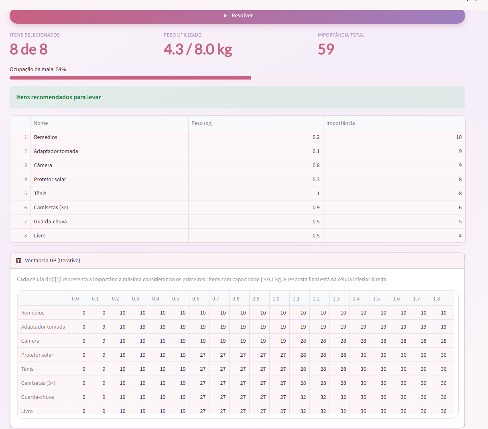

# G31_Programacao-Dinamica_PA-26.1

Número da Lista: 31<br>
Conteúdo da Disciplina: Programação Dinâmica<br>

## Alunos

|Matrícula|Aluno|Github|
|---------|----|---------|
|211031566|Ana Joyce|[anajoyceamorim](https://github.com/anajoyceamorim)|

## Sobre
Nesse projeto, o usuário define o limite de peso de uma mala de viagem e cadastra itens com seus respectivos pesos e graus de importância. Usando o algoritmo **Knapsack 0/1** (Programação Dinâmica), a aplicação seleciona a combinação de itens que maximiza a importância total sem ultrapassar o limite de peso. O usuário pode alternar entre a versão **iterativa** (tabulation) e a versão **recursiva** (memoization) do algoritmo e visualizar a tabela DP gerada.

## Instalação
Linguagem: Python<br>
Framework: Streamlit<br>

## Dependências

Este projeto foi desenvolvido com as seguintes tecnologias:
- **Python** (recomendado `v3.10` ou superior)
- **Streamlit** `>= 1.x`
- **Pandas** `>= 2.x`

## Instalando dependências

Antes de executar o projeto, crie um ambiente virtual e instale as dependências:

```bash
python3 -m venv venv
source venv/bin/activate
pip install -r requirements.txt
```

## Rodar o projeto

Com o ambiente virtual ativo, rode o comando abaixo:

```bash
streamlit run app.py
```

Siga para [http://localhost:8501/](http://localhost:8501/) para ver a aplicação rodando

## Screenshots

### Tela inicial com itens de exemplo


### Resultado do algoritmo
